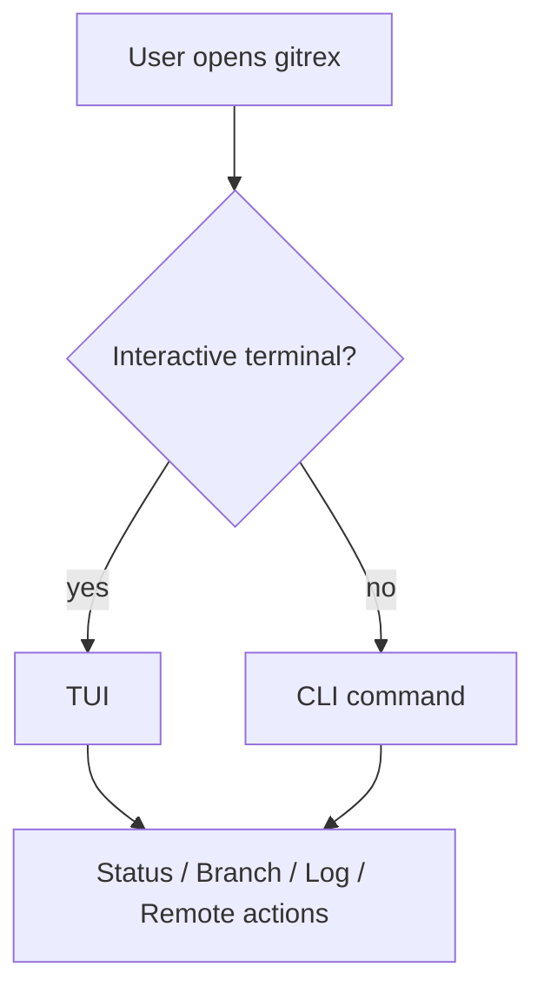

# gitrex

<p align="center">
  
  
  
  
</p>

<p align="center">
  <b>A terminal-first git manager written in Rust.</b><br />
  Fast CLI commands when you want precision. A TUI when you want the workflow in one place.
</p>

<p align="center">
  <a href="#features">Features</a> ·
  <a href="#quick-start">Quick Start</a> ·
  <a href="#commands">Commands</a> ·
  <a href="#development">Development</a>
</p>

---

## Overview

`gitrex` brings common git workflows into a focused terminal experience.

- Defaults to a TUI in interactive terminals
- Falls back to CLI behavior for scripts and pipes
- Uses an embedded libgit2 backend, so it does not depend on the `git` binary being installed
- Covers core repository operations: status, branch inspection, log review, checkout, switch, branch creation, clone, pull, and push
- TUI includes separate local and remote branch panels, plus a wide `Git Graph` panel with tree lines, commit navigation, and commit actions
- The active branch panel drives the graph selection, so switching between local and remote refs updates the graph in place

## Features

| Workflow | What you get |
| --- | --- |
| Repository status | Branch, upstream, divergence, and working tree changes |
| Branch management | List remote refs by remote, show local-only and synced branches, switch between local and remote panels, and create branches from another ref |
| Commit history | Compact log output with configurable limits |
| Git graph | Full commit tree, commit selection, rotating selected subject text, and commit actions |
| Remote operations | Clone, pull, and push from the same CLI |
| TUI mode | A terminal UI for working inside the repo without leaving the keyboard |

## Quick Start

### Build locally

```bash
cargo build --release
```

### Run the TUI

```bash
cargo run -- tui
```

### TUI navigation

- `1/2/3` switch between status, branches, and graph
- `j/k` or arrow keys move within the active panel
- In `Branches`, `Tab` and `Shift+Tab` toggle between the local and remote branch panels
- In `Branches`, `/` opens branch search and filters both local and remote refs
- In the local branch panel, `Enter` opens branch actions for checkout, switch, pull, push, or creating a branch from the selected source
- In the remote branch panel, `Enter` opens branch actions for creating a local branch from the remote ref or checking out detached HEAD at that ref
- The `Git Graph` title follows the active branch panel selection, so remote refs are visible there too
- In `Git Graph`, `Enter` opens commit actions for the hovered commit
- The selected commit subject scrolls when it does not fit, while date and hash stay aligned

### Run a command directly

```bash
gitrex status
gitrex branch
gitrex log --limit 20
```

## Commands

| Command | Description |
| --- | --- |
| `gitrex` | Launches the TUI in interactive terminals |
| `gitrex status` | Prints the current branch, upstream, divergence, and working tree state |
| `gitrex branch` | Lists remote branches grouped by remote and local branches with sync status |
| `gitrex log --limit <n>` | Shows recent commits, defaulting to 20 |
| `gitrex checkout <target>` | Checks out an existing branch or ref |
| `gitrex switch <target>` | Switches to a branch |
| `gitrex create-branch <name> --from <target>` | Creates a new branch, optionally from another ref |
| `gitrex clone <repository> [directory]` | Clones a repository to an optional destination |
| `gitrex pull [remote] [branch]` | Pulls updates from a remote and branch |
| `gitrex push [remote] [branch]` | Pushes commits to a remote and branch |
| `gitrex tui` | Opens the TUI explicitly |

## Example Output

```text
branch: main
upstream: origin/main
working tree: clean
```

```text
remote branches:
  origin
    main
    feature/login
  upstream
    main
local branches:
* main [synced: origin/main, upstream/main]
  feature/login [local-only]
  release [local-only]
```

## How It Fits Together



## Development

### Build

```bash
cargo build
```

### Test

```bash
cargo test
```

### Project context

- Repository rules live in [CONTEXT.md](./CONTEXT.md)
- Format guidance lives in [CONTEXT-FORMAT.md](./CONTEXT-FORMAT.md)

## Tech Stack

- Rust 2021
- `clap` for CLI parsing
- `crossterm` for terminal control
- `git2` for the embedded Git backend
- `chrono` for date formatting
- `ratatui` for the TUI
- `anyhow` and `thiserror` for error handling

## License

No license file is present in this repository yet.
