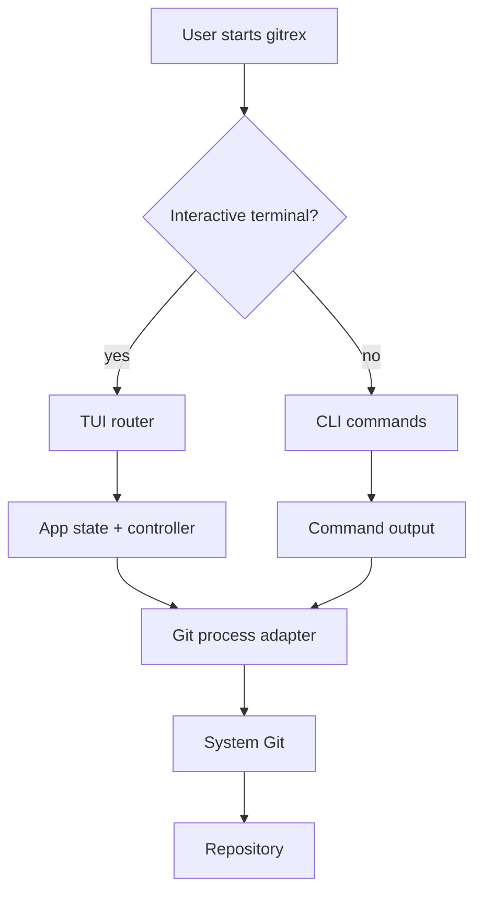
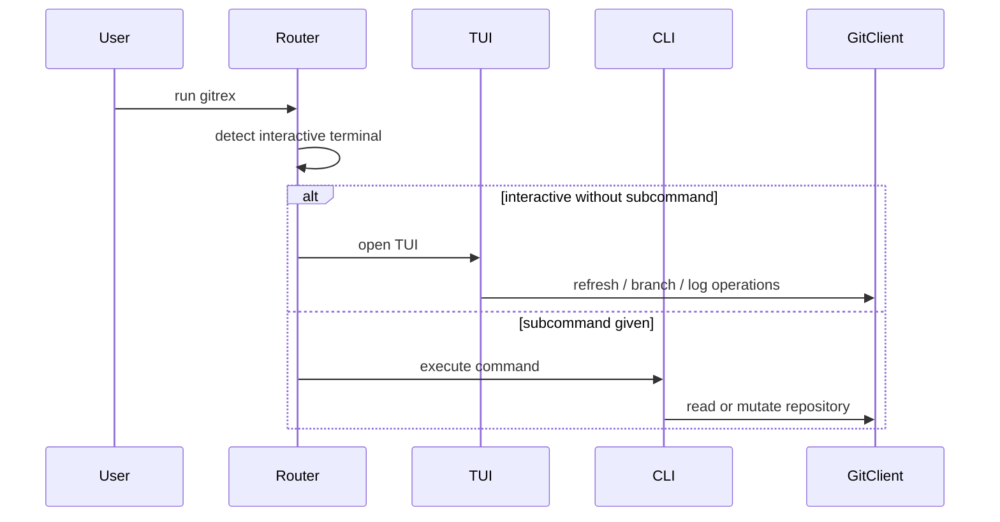
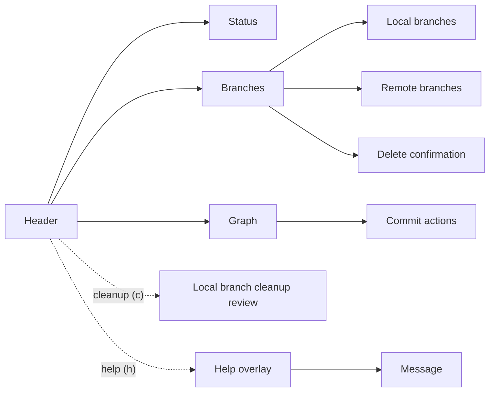

# gitrex

<p align="center">
  
</p>

<p align="center" style="display: flex; justify-content: center; gap: 8px; flex-wrap: wrap;">
  
  
  
  
</p>

<p align="center">
  <b>A terminal-first git manager written in Rust.</b><br />
  Interactive terminals open the TUI by default. Non-interactive runs stay on the CLI path.
</p>

<p align="center">
  <a href="#overview">Overview</a> ·
  <a href="#installation">Installation</a> ·
  <a href="#architecture">Architecture</a> ·
  <a href="#tui">TUI</a> ·
  <a href="#commands">Commands</a> ·
  <a href="#development">Development</a>
</p>

## Overview

`gitrex` packages the common git workflows into one terminal tool:

- Defaults to the TUI when both `stdin` and `stdout` are terminals
- Falls back to CLI output for scripts, pipes, and automation
- Uses the installed `git` executable for repository inspection and repository mutations
- Uses the installed `git` executable in both runtime operations and repository test fixtures
- Covers status, branch inspection, recent commit review, checkout, switch, branch creation, clone, fetch, pull, and push
- Includes a branch-focused TUI with local/remote panels, branch search, branch deletion confirmation, branch-specific graph navigation, and commit actions
- Shows a loading splash while the local repository snapshot is being loaded

## Installation

`gitrex` requires [Git](https://git-scm.com/) and a Rust toolchain with Cargo.
The recommended installation uses Cargo directly from this repository and installs the executable as `gitrex`.

### macOS

1. Make sure Git is available. macOS can provide it through the Xcode Command Line Tools:

   ```bash
   xcode-select --install
   ```

2. Install Rust with `rustup` if `cargo` is not already available:

   ```bash
   curl --proto '=https' --tlsv1.2 -sSf https://sh.rustup.rs | sh
   source "$HOME/.cargo/env"
   ```

3. Install GitRex:

   ```bash
   cargo install --git https://github.com/MarcosAlves90/gitrex --locked gitrex
   ```

4. Run it from any Git repository:

   ```bash
   gitrex
   ```

### Linux

1. Install Git with your distribution package manager and verify that it is available:

   ```bash
   git --version
   ```

2. Install Rust with `rustup` if `cargo` is not already available:

   ```bash
   curl --proto '=https' --tlsv1.2 -sSf https://sh.rustup.rs | sh
   source "$HOME/.cargo/env"
   ```

3. Install GitRex:

   ```bash
   cargo install --git https://github.com/MarcosAlves90/gitrex --locked gitrex
   ```

4. Run it from any Git repository:

   ```bash
   gitrex
   ```

### Windows

1. Install Git and Rust with `winget` if they are not already available:

   ```powershell
   winget install --id Git.Git --source winget
   winget install --id Rustlang.Rustup --source winget
   ```

   If `rustup` offers to install the MSVC prerequisites, install them so Rust has the linker and Windows SDK required to build the executable.
   Reopen PowerShell after installation so the updated `PATH` is loaded.

2. Install GitRex:

   ```powershell
   cargo install --git https://github.com/MarcosAlves90/gitrex --locked gitrex
   ```

3. Run it from any Git repository:

   ```powershell
   gitrex
   ```

### `gitrex` is installed but not found

Cargo installs command-line binaries in `~/.cargo/bin` on macOS/Linux and `%USERPROFILE%\.cargo\bin` on Windows.
If `cargo install` reports that GitRex is already installed but the shell returns `command not found`, add Cargo's binary directory to `PATH`.

For zsh on macOS or Linux:

```bash
grep -qxF 'export PATH="$HOME/.cargo/bin:$PATH"' ~/.zshrc \
  || echo 'export PATH="$HOME/.cargo/bin:$PATH"' >> ~/.zshrc
source ~/.zshrc
rehash
```

For bash on Linux:

```bash
grep -qxF 'export PATH="$HOME/.cargo/bin:$PATH"' ~/.bashrc \
  || echo 'export PATH="$HOME/.cargo/bin:$PATH"' >> ~/.bashrc
source ~/.bashrc
hash -r
```

Verify the installation:

```bash
command -v gitrex
gitrex
```

For PowerShell on Windows:

```powershell
$cargoBin = Join-Path $HOME '.cargo\bin'
$userPath = [Environment]::GetEnvironmentVariable('Path', 'User')
if (($userPath -split ';') -notcontains $cargoBin) {
    [Environment]::SetEnvironmentVariable('Path', "$cargoBin;$userPath", 'User')
}
$env:Path = "$cargoBin;$env:Path"
Get-Command gitrex
gitrex
```

The PowerShell command updates the current session immediately and adds Cargo's binary directory to the user `PATH` for future terminal sessions.

## Architecture





## TUI

The TUI keeps repository status visible as an informational panel and provides two navigable views:

- `[1] Branches`
- `[2] Graph`

`Status` remains visible but does not receive keyboard focus because it has no panel-specific actions.



### Navigation

- `1` focuses branches and `2` focuses the graph; the same numbers are shown in their panel titles
- `j/k` or arrow keys move within the active panel
- `h` opens the help screen
- `c` opens the merged local branch cleanup review
- `Esc` or `h` closes the help screen
- `r` refreshes the repository state

### Branches view

- `Tab` and `Shift+Tab` switch between local and remote branch panels
- `/` opens branch search and filters both local and remote refs
- `Enter` opens the branch action picker for the active panel
- In the local branch panel, branch actions include checkout, switch, pull, push, and creating a branch from the selected source
- In the local branch panel, branch actions also include deleting the selected local branch after confirmation
- In the remote branch panel, branch actions include creating a local branch, checking out detached HEAD, or deleting the selected remote branch after confirmation

The cleanup review lists local branches whose tips are reachable from `HEAD`. Branches are selected by default; use `j`/`k` to move through the list, `Space` to toggle one, `a` to select all, and `n` to clear the selection. The selected branch stays in view when the list is longer than the terminal. `Enter` opens a scrollable warning with the selected names; press `Enter` again to confirm or `Esc` to go back or cancel. The result report also supports scrolling with `j`/`k` or `PgUp`/`PgDn`. The cleanup checks each branch again and uses Git's safe `branch -d` deletion. Current and base branches are protected. The operation only changes local branch refs and does not fetch, prune, push, or delete remote branches.

### Graph workspace

Press `2` to open a dedicated graph workspace. The branch/status panels are replaced by the graph and a selected-commit inspector so the available terminal area is used for
history analysis.

- `j/k` or `↑/↓` move one commit at a time
- `PageUp/PageDown` move by the currently visible graph page
- `Home/End` or `g/G` jump to the first or last commit
- `←/→` pan a long selected commit subject manually; the graph never auto-scrolls text
- `Enter` opens commit actions for the selected commit
- The selected-commit panel shows the full subject, author, date, full hash, and graph scope
- The graph follows the branch or remote ref selected in the Branches view
- Wide terminals place commit details beside the graph; narrower terminals stack details below it
- Date/hash columns disappear progressively on narrow terminals to preserve the graph lanes and commit subject

#### Commit actions

`Enter` opens actions for the selected commit. **Compare** asks for another commit or branch, resolves both references, and shows a scrollable diff-stat summary with at most 250 path entries. It does not move refs, change the index or worktree, or contact a remote. Use `j`/`k`, the arrow keys, or `PgUp`/`PgDn` to review long results.

**Cherry-pick** requires choosing and reviewing an existing local destination branch. The index and worktree, including untracked files, must be clean before Git switches branches. GitRex also protects ignored paths: it refuses a switch that would overwrite one and checks the selected commit's changed paths before switching. After an attempt, the destination stays active. Real file conflicts refresh the status and remain for you to resolve and finish with `git cherry-pick --continue` or cancel with `git cherry-pick --abort`. If a patch is already applied and Git stops with an empty pick, GitRex reports that state separately and gives `git cherry-pick --skip` or `--abort` guidance.

**Reset current branch** is available only when the graph shows the checked-out local branch. Choose Soft, Mixed, or Hard; Soft is selected by default. Soft moves the branch tip and leaves the index and worktree unchanged. Mixed also resets the index while keeping worktree files. Hard overwrites tracked index and worktree files. Its separate destructive review lists dirty paths and any ignored/untracked paths that collide with the target tree; a collision blocks reset until you move or remove the path. GitRex rechecks the current branch, `HEAD`, and path collisions immediately before reset. These actions run asynchronously and never stash changes or resolve conflicts automatically.

### Help screen

The help screen is scrollable:

- `j/k` or `↑/↓` scroll the shortcuts panel
- A scrollbar shows position and range
- The bottom `Message` panel stays fixed and shows the close hint

## Commands

| Command | Description |
| --- | --- |
| `gitrex` | Opens the TUI in interactive terminals |
| `gitrex status` | Prints the current branch, upstream, divergence, and working tree state |
| `gitrex branch` | Lists remote branches grouped by remote and local branches with sync status |
| `gitrex log --limit <n>` | Shows recent commits from the current branch history, defaulting to 20 |
| `gitrex checkout <target>` | Checks out an existing branch or ref |
| `gitrex switch <target>` | Switches to a branch |
| `gitrex create-branch <name> --from <target>` | Creates a new branch, optionally from another ref |
| `gitrex clone <repository> [directory]` | Clones a repository to an optional destination |
| `gitrex fetch [remote]` | Explicitly refreshes and prunes remote-tracking refs |
| `gitrex pull [remote] [branch]` | Pulls updates from a remote and branch |
| `gitrex push [remote] [branch]` | Pushes commits to a remote and branch |
| `gitrex cleanup [options]` | Previews merged local branches; requires `--yes` to delete them |
| `gitrex tui` | Forces the TUI explicitly |

### Local branch cleanup

```bash
gitrex cleanup
gitrex cleanup --base main --exclude keep-this --exclude release/next
gitrex cleanup --base main --remote origin --remote upstream --yes
```

The default base is the current `HEAD`. Use `--base <ref>` to choose another commit or ref, `--exclude <name>` one or more times to preserve exact local branch names, and `--remote <name>` one or more times to include branches whose upstream uses any selected configured remote. Remote filtering reads local Git configuration and does not contact the remotes. Without `--yes`, the command only prints the candidates. With `--yes`, it rechecks each candidate against the same filters and attempts `git branch -d -- <name>`, reporting deleted, skipped, and failed branches separately.

Cleanup is based on commit ancestry: a branch tip must be an ancestor of the base commit. A squash merge or rebase can preserve the changes while producing different commit IDs, so those branches may not appear as merged. Git's safe deletion check is repeated for every branch and may still refuse a branch when Git sees unmerged commits.

### Machine-readable protocol

status, branch, and log keep their human-readable output by default. Add --format json to receive the versioned machine protocol. capabilities describes the supported commands and can also be printed as JSON:

    gitrex status --format json
    gitrex branch --format json
    gitrex log --limit 5 --format json
    gitrex capabilities --format json

Every protocol response has schema_version (integer), operation (command name string), and ok (boolean). A successful response contains data; a failed response contains error; warnings is an optional array of strings. The envelope fields that do not apply are omitted.

For example, a failed status request outside a repository is:

    {
      "schema_version": 1,
      "operation": "status",
      "ok": false,
      "error": {
        "code": "NOT_A_REPOSITORY",
        "message": "repository not found",
        "retryable": false
      }
    }

The stable data fields are:

| Operation | Fields and JSON types |
| --- | --- |
| status | branch_name: string; upstream: string or null; ahead and behind: integers; files: array of objects with code and path strings |
| branch | branches: array of objects with name (string), current (boolean), upstream (string or null), commit (string), subject (string), and kind (local or remote) |
| log | commits: array of objects with hash, author, date (YYYY-MM-DD), and subject, all strings |
| capabilities | gitrex_version (string); protocol_schema_version (integer); supported_output_formats (string array); operations (array); authorization (object) |

Each capabilities operation has name (string), effects (array of effect names), and output_formats (string array). The authorization object has granted (boolean, always false) and note (string). Empty collections are returned as empty arrays.

Error code is the stable machine identifier. message is a human-readable diagnostic string and may change. retryable is an optional boolean and is omitted when uncertain. Optional details is an object: REFERENCE_NOT_FOUND includes reference (string), COMMAND_FAILED includes command (string) and may include exit_code (integer), and DIVERGED includes ahead and behind (integers). I/O and backend failures share BACKEND_ERROR.

| Code | Meaning |
| --- | --- |
| GIT_NOT_INSTALLED | Git could not be started because it is unavailable |
| NOT_A_REPOSITORY | The current directory is not inside a Git repository |
| REFERENCE_NOT_FOUND | A requested Git reference does not exist |
| COMMAND_FAILED | A Git command returned a failure status |
| DIVERGED | A pull cannot fast-forward because local and remote histories diverged |
| BACKEND_ERROR | GitRex or operating-system I/O failed |
| PARSE_ERROR | GitRex could not parse Git output |
| INVALID_UTF8 | Git output was not valid UTF-8 |

capabilities includes gitrex_version, protocol_schema_version, supported_output_formats, and an ordered operations array. Each operation lists its name, possible effects, and output_formats. Effects are read_only, local_mutation, network_access, and remote_mutation; a command may have more than one. authorization.granted is always false: discovery describes availability and does not authorize execution.

Exit status is 0 on success, 1 for a Git operation failure, and 2 for invalid command syntax or option values. JSON operation failures write the envelope to stdout and retain a readable diagnostic on stderr. Clap usage errors remain human-readable.

The protocol schema version is independent of the GitRex package version. Clients should check schema_version and operation, use error codes instead of parsing messages, and ignore unknown object fields and operation entries. Additive optional fields are compatible; removing or renaming fields, changing a field's type or meaning, or changing required behavior requires a schema-version increment. Versioned response fixtures live in tests/fixtures/protocol/v1/; update them only with the matching protocol-version change.

## Example Output

```text
branch: main
upstream: origin/main
working tree: clean
```

```text
remote branches:
  origin
    main
    feature/login
  upstream
    main
local branches:
* main [synced: origin/main, upstream/main]
  feature/login [local-only]
  release [local-only]
```

## Quick Start

### Build

```bash
cargo build --release
```

### Run the TUI

```bash
cargo run
```

To force the TUI explicitly:

```bash
cargo run -- tui
```

### Run a CLI command

```bash
cargo run -- status
cargo run -- branch
cargo run -- log --limit 20
```

## Development

### Build

```bash
cargo build
```

### Test

```bash
cargo test
```

### Project context

- Repository rules live in [CONTEXT.md](./CONTEXT.md)
- Format guidance lives in [CONTEXT-FORMAT.md](./CONTEXT-FORMAT.md)

## Tech Stack

- Rust 2021
- `clap` for CLI parsing
- `crossterm` for terminal control
- system Git for repository inspection and mutation execution
- system Git for repository test fixtures
- `ratatui` for the TUI
- `anyhow` and `thiserror` for error handling

## Notes

- The CLI path prints a help hint when no subcommand is provided outside an interactive terminal.
- The TUI is the primary interactive experience.
- Read-only commands and TUI snapshots do not perform network I/O implicitly.
- Run `gitrex fetch` when you want to refresh remote-tracking refs explicitly.
- Explicit pulls are fast-forward-only and reject diverged histories without moving local HEAD.
- Captured Git commands disable terminal credential prompts and rely on configured credential helpers or agents.
