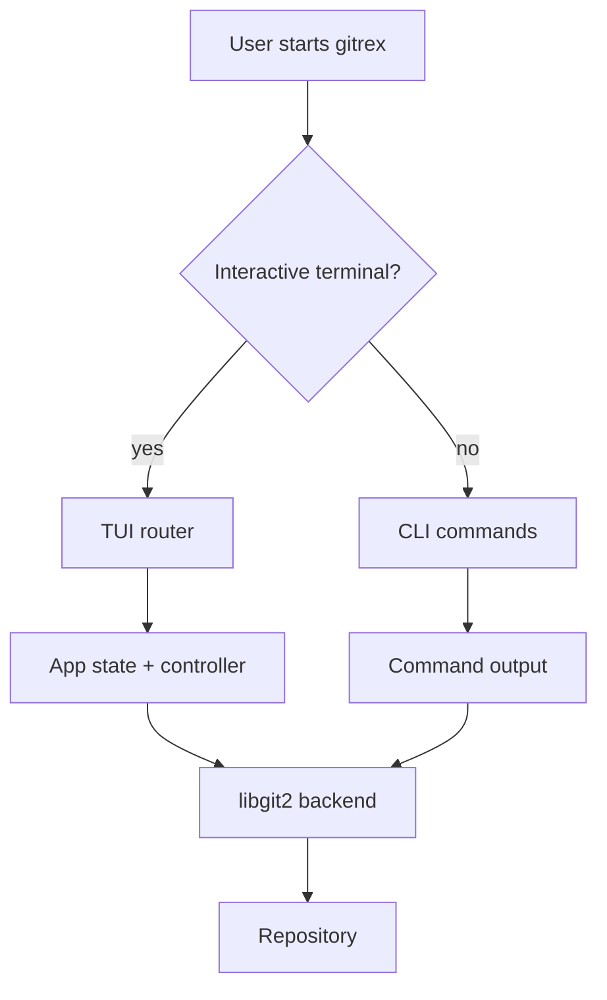
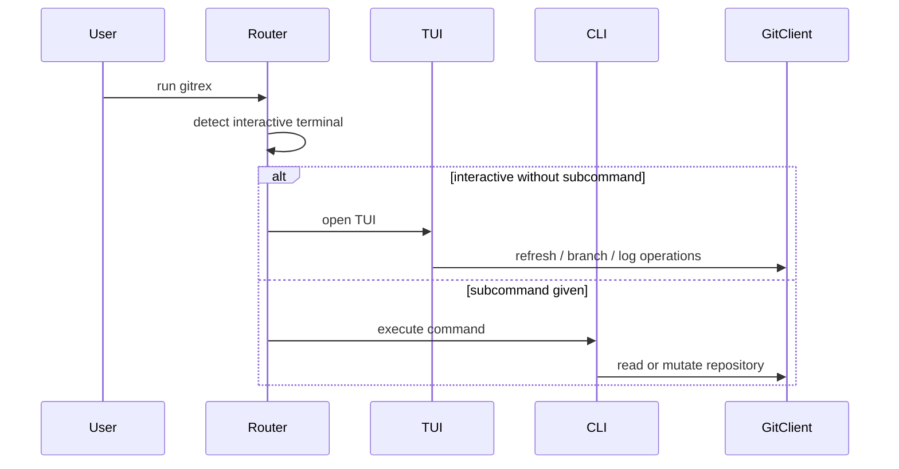
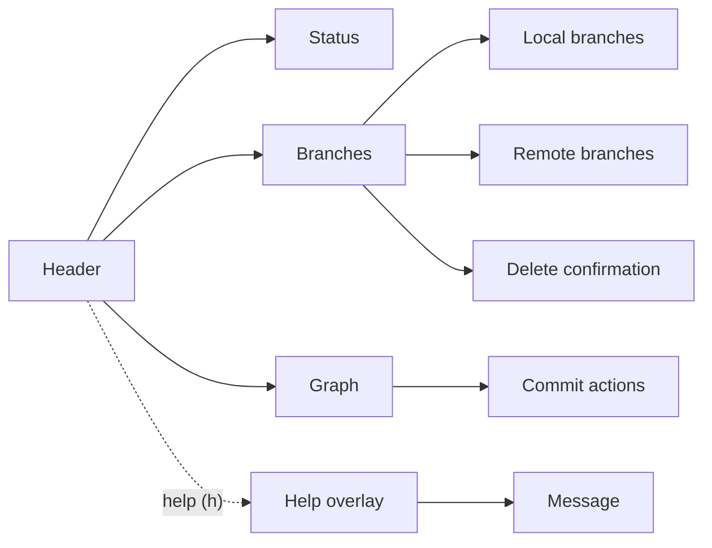

<div align="center">

```text
⠀⠀⠀⣴⣀⣤⣦⣤⣤⣀⡀⠀⠀⠀⠀⠀⠀⠀⠀⠀⠀⠀⠀⠀
⠀⢠⣴⠿⠛⣿⣿⠋⠻⣿⣟⠻⠿⠿⢿⣿⣿⣶⣶⡦⣤⣀⡀⠀
⢰⣿⣧⣴⣦⢿⣿⣷⡦⠘⣿⠀⠀⠀⠀⣹⠉⣿⣿⣿⣶⣬⣷⠀
⠘⠟⢻⣿⠋⠀⢿⣿⣷⣼⣿⣷⣤⣤⣴⣿⣿⣿⣿⣿⣿⣿⢿⠃
⠀⠀⢠⣿⣶⣶⣿⣿⣿⣿⠟⠉⠉⠙⠻⠟⡿⢻⢿⢻⡏⠏⠀⠀
⠀⣾⣿⣿⣿⣿⣿⣿⣿⣧⣤⣀⡀⠀⠀⠀⠁⠈⠘⠈⠀⠀⠀⠀
⠀⠈⠉⠳⣾⣿⣿⣿⣿⣿⣿⣿⣿⣦⣶⣄⢠⢰⣴⢠⠀⣄⠀⠀
⠀⠀⠀⠀⠈⠙⠿⣿⣝⣿⣿⣿⣿⣿⣿⣿⣿⣾⣿⣿⣷⡟⠀⠀
⠀⠀⠀⠀⠀⠀⠀⠈⠙⠛⠛⠛⠛⠛⠛⠛⠛⠻⠿⠟⠋⠀⠀⠀
```

</div>

# gitrex

<p align="center" style="display: flex; justify-content: center; gap: 8px; flex-wrap: wrap;">
  
  
  
  
</p>

<p align="center">
  <b>A terminal-first git manager written in Rust.</b><br />
  Interactive terminals open the TUI by default. Non-interactive runs stay on the CLI path.
</p>

<p align="center">
  <a href="#overview">Overview</a> ·
  <a href="#architecture">Architecture</a> ·
  <a href="#tui">TUI</a> ·
  <a href="#commands">Commands</a> ·
  <a href="#development">Development</a>
</p>

## Overview

`gitrex` packages the common git workflows into one terminal tool:

- Defaults to the TUI when both `stdin` and `stdout` are terminals
- Falls back to CLI output for scripts, pipes, and automation
- Uses an embedded libgit2 backend, so it does not depend on the `git` binary
- Covers status, branch inspection, recent commit review, checkout, switch, branch creation, clone, pull, and push
- Includes a branch-focused TUI with local/remote panels, branch-specific graph navigation, branch actions, and commit actions

## Architecture





## TUI

The TUI is built around three top-level views:

- `Status`
- `Branches`
- `Graph`



### Navigation

- `1/2/3` switch between status, branches, and graph
- `j/k` or arrow keys move within the active panel
- `h` opens the help screen
- `Esc` or `h` closes the help screen
- `r` refreshes the repository state

### Branches view

- `Tab` and `Shift+Tab` switch between local and remote branch panels
- `/` opens branch search and filters both local and remote refs
- `Enter` opens the branch action picker for the active panel
- In the local branch panel, branch actions include checkout, switch, pull, push, and creating a branch from the selected source
- In the remote branch panel, branch actions include creating a local branch or checking out detached HEAD
### Graph view

- `j/k` or arrow keys move between commits
- `Enter` opens commit actions for the selected commit
- The graph follows the selected branch in the Branches view
- The selected commit subject scrolls when it does not fit

### Help screen

The help screen is scrollable:

- `j/k` or `↑/↓` scroll the shortcuts panel
- A scrollbar shows position and range
- The bottom `Message` panel stays fixed and shows the close hint

## Commands

| Command | Description |
| --- | --- |
| `gitrex` | Opens the TUI in interactive terminals |
| `gitrex status` | Prints the current branch, upstream, divergence, and working tree state |
| `gitrex branch` | Lists remote branches grouped by remote and local branches with sync status |
| `gitrex log --limit <n>` | Shows recent commits from the current branch history, defaulting to 20 |
| `gitrex checkout <target>` | Checks out an existing branch or ref |
| `gitrex switch <target>` | Switches to a branch |
| `gitrex create-branch <name> --from <target>` | Creates a new branch, optionally from another ref |
| `gitrex clone <repository> [directory]` | Clones a repository to an optional destination |
| `gitrex pull [remote] [branch]` | Pulls updates from a remote and branch |
| `gitrex push [remote] [branch]` | Pushes commits to a remote and branch |
| `gitrex tui` | Forces the TUI explicitly |

## Example Output

```text
branch: main
upstream: origin/main
working tree: clean
```

```text
remote branches:
  origin
    main
    feature/login
  upstream
    main
local branches:
* main [synced: origin/main, upstream/main]
  feature/login [local-only]
  release [local-only]
```

## Quick Start

### Build

```bash
cargo build --release
```

### Run the TUI

```bash
cargo run
```

To force the TUI explicitly:

```bash
cargo run -- tui
```

### Run a CLI command

```bash
cargo run -- status
cargo run -- branch
cargo run -- log --limit 20
```

## Development

### Build

```bash
cargo build
```

### Test

```bash
cargo test
```

### Project context

- Repository rules live in [CONTEXT.md](./CONTEXT.md)
- Format guidance lives in [CONTEXT-FORMAT.md](./CONTEXT-FORMAT.md)

## Tech Stack

- Rust 2021
- `clap` for CLI parsing
- `crossterm` for terminal control
- `git2` with vendored libgit2 for repository access
- `chrono` for date formatting
- `ratatui` for the TUI
- `anyhow` and `thiserror` for error handling

## Notes

- The CLI path prints a help hint when no subcommand is provided outside an interactive terminal.
- The TUI is the primary interactive experience.
